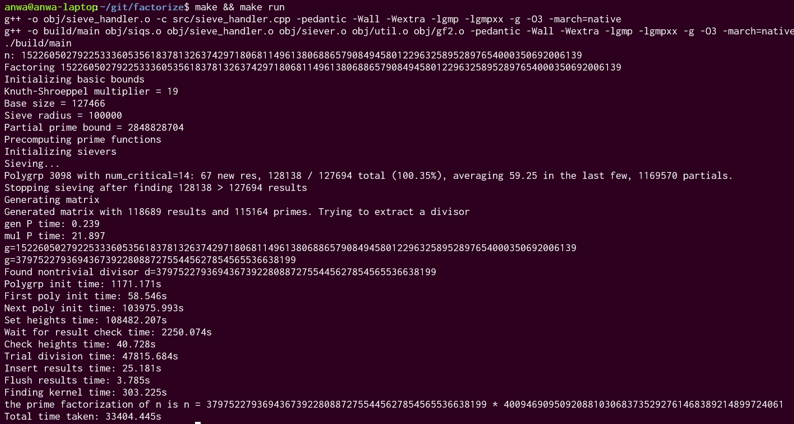

# Factorize

A repository for factorizing large integers. The current 
implementation is the 
[self-initializing quadratic sieve](https://www.rieselprime.de/ziki/Self-initializing_quadratic_sieve)
(SIQS). It uses the large prime variant for partial congruences, 
forgoes sieving with tiny primes (\<256),
stores basic ``resieved'' values for big primes (\>sieve diameter), and
uses the Block Wiedemann algorithm for linear dependency extraction.

This is written in C++ using the [gmp](https://gmplib.org/)
library mpz for multiprecision arithmetic. The build is managed with make.

### Sample Run

The following is a sample run of the main SIQS algorithm on the 
330 bit RSA key 
[RSA-100](https://en.wikipedia.org/wiki/RSA_numbers#RSA-100):



### Sample usage
Generate empty `build/` and `obj/` directories:
```bash
make gen
```
Compile:
```bash
make
```
(Optional) Compile and generate `compile_commands.json` with `bear`:
```bash
bear -- make
```
Run:
```bash
make run
```
Test (basic util and gf2 functions):
```bash
make test
```


